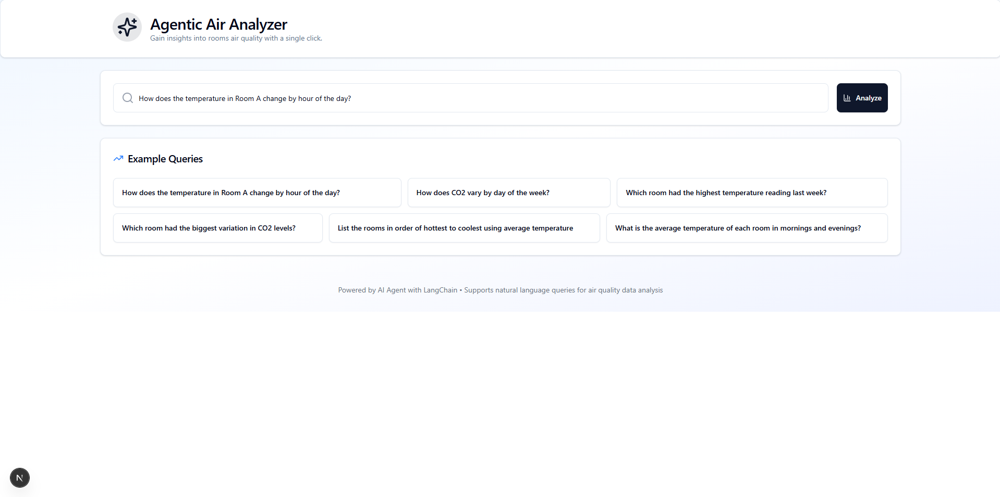

# 🌀 Agentic Air Analyzer

> 🚀 AI-powered platform for **multi-room air quality analysis** using **LangChain agents**, **FastAPI**, and **Groq’s LLaMA 3.3 70B** model.  
> 🌬️ Understand CO₂, temperature, and humidity patterns through intelligent agents and natural language queries.


---

## 🧠 Features

✅ **Multi-Agent Architecture** using LangChain  
✅ **Natural Language Interface** powered by LLaMA 3.3 (70B) via Groq  
✅ **Smart Chart/Table Generation** based on queries  
✅ **Room-based Data Analytics**: CO₂, humidity, temperature  
✅ **FastAPI Backend** with modular workflow pipelines  
✅ **Next.js 15 Frontend** with Tailwind + shadcn/ui  
✅ **Scalable + Extensible AI Infrastructure**

---

## 📸 UI Preview



---

## 🏗️ Architecture Overview

```text
Frontend (Next.js 15 + Tailwind + shadcn)
       |
    [ REST API ]
       |
Backend (FastAPI + LangChain Agents)
       |
   Groq LLaMA 3.3-70B → Multi-Agent Workflow (Chart Agent, Table Agent, Insight Agent)
